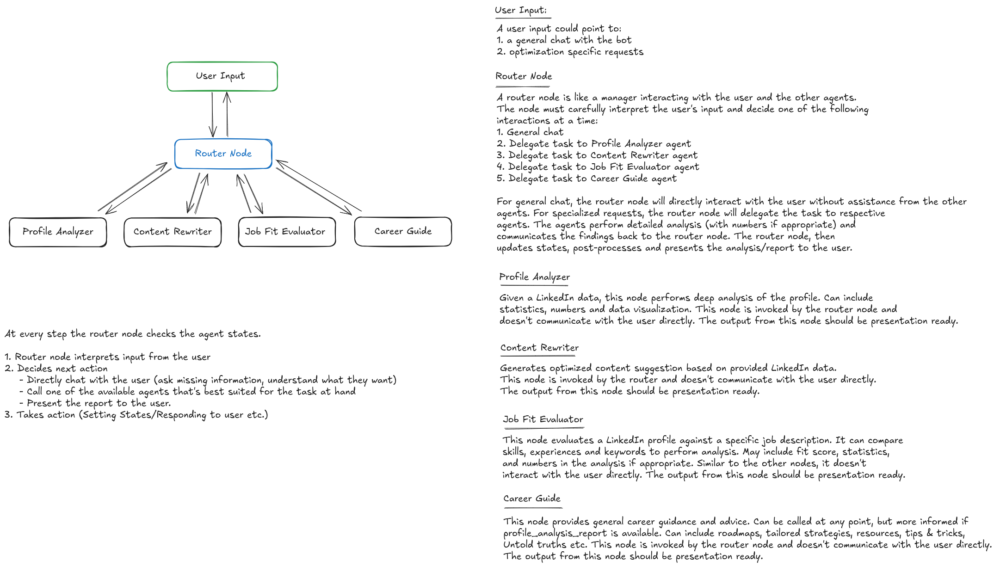
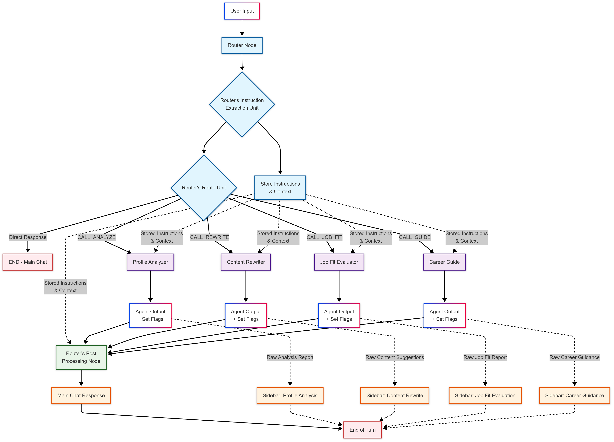

# Linked Squad 🧞‍♂️

> **An AI-powered career assistant that transforms your LinkedIn profile, evaluates job fit, and guides your job search with smart, personalized insights.**


[](https://python.org)
[](https://langchain.com)
[](https://langgraph.com)
[](https://streamlit.io)
[](https://docker.com)

## Features

###  **Intelligent Profile Analysis**
- **Comprehensive Profile Scoring**: Get detailed completeness (0-100%) and impact scores for your LinkedIn profile
- **Section-by-Section Analysis**: In-depth evaluation of headline, summary, experience, skills, and recommendations
- **Keyword Gap Identification**: Discover missing and underutilized keywords for better visibility
- **Actionable Recommendations**: Prioritized suggestions for immediate profile improvements

### **AI-Powered Content Rewriting**
- **Professional Content Generation**: AI-optimized suggestions for your LinkedIn sections
- **Quantifiable Achievements**: Transform responsibilities into measurable results with metrics
- **Keyword Integration**: Natural incorporation of industry-relevant keywords
- **Multiple Variations**: Get 2-3 alternative suggestions for each section

### **Job Fit Evaluation**
- **Compatibility Scoring**: Percentage-based job fit analysis (0-100%)
- **Skills Gap Analysis**: Identify missing skills and get actionable recommendations
- **Experience Alignment**: Compare your background with job requirements
- **Enhancement Roadmap**: Specific steps to improve your profile for target roles

### **Career Guidance**
- **Personalized Career Advice**: Tailored guidance based on your profile and goals
- **Skill Development Roadmaps**: Strategic plans for career growth
- **Networking Strategies**: Professional networking and personal branding tips
- **Industry Insights**: Non-obvious career progression advice

### **Intelligent Conversation Flow**
- **Smart Routing**: AI-powered conversation management with context awareness
- **Multi-Agent Architecture**: Specialized agents for different tasks (analysis, rewriting, job fit, guidance)
- **Memory Management**: Persistent conversation history and state management
- **Natural Interactions**: Chat-based interface with intelligent response handling

## Architecture

### Initial Plan/Schema


### Actual Implementation Schema

This project uses a sophisticated multi-agent architecture built with **LangGraph** and **LangChain**:

### **Specialized AI Agents**
- **Router Agent**: Intelligent conversation flow management and action routing
- **Profile Analyzer**: Deep LinkedIn profile analysis and scoring
- **Content Rewriter**: Professional content optimization and rewriting
- **Job Fit Evaluator**: Job description matching and gap analysis
- **Career Guide**: Personalized career advice and strategic guidance

### **Technical Stack**
- **Backend**: Python 3.12+ with LangChain & LangGraph
- **AI Model**: Google Gemini 2.5 Flash for natural language processing
- **Frontend**: Streamlit web application with modern UI
- **State Management**: Pydantic models with type safety
- **Memory**: LangGraph checkpointing for conversation persistence
- **Containerization**: Docker with conda environment

## Quick Start

### Important Note:
**The application now runs as a modern web interface using Streamlit. The terminal interface has been deprecated but is still available for legacy use.**

### Prerequisites
- Python 3.12+
- Google AI API key (for Gemini)
- Docker (optional)

### 1. Clone the Repository
```bash
git clone https://github.com/shre-db/linked-squad.git
cd linked-squad
```

### 2. Environment Setup

#### Option A: Using Conda (Recommended)
```bash
# Create environment from file
conda env create -f environment.yaml

# Activate environment
conda activate linked-squad
```

#### Option B: Using pip
```bash
# Create virtual environment
python -m venv venv
source venv/bin/activate  # On Windows: venv\Scripts\activate

# Install dependencies
pip install -r requirements.txt
```

### 3. Configure API Keys
```bash
# Copy example environment file
cp .env.example .env

# Edit .env file with your API keys
GOOGLE_API_KEY=your_google_api_key_here
APIFY_API_TOKEN=your_apify_api_token_here  # Optional, for future scraping
```

### 4. Run the Application
In your project's root directory:
```bash
# Streamlit web interface (recommended)
PYTHONPATH=. streamlit run app/streamlit_app.py

# Legacy terminal interface (deprecated)
PYTHONPATH=. python app/deprecated_terminal_app.py #(Do not run this!)
```

## Docker Setup Guide

This project provides two Docker configurations to suit different preferences and use cases:

### Option 1: Virtual Environment (Dockerfile.venv) - **Recommended**

**Build and run:**
```bash
# Build the image
docker build -f Dockerfile.venv -t linked-squad:venv .

# Run the container
docker run -p 8501:8501 --env-file .env linked-squad:venv
```

### Option 2: Conda Environment (Dockerfile.conda)


**Build and run:**
```bash
# Build the image
docker build -f Dockerfile.conda -t linked-squad:conda .

# Run the container
docker run -p 8501:8501 --env-file .env linked-squad:conda
```

### Environment Variables

Both Dockerfiles expect a `.env` file with your environment variables. Create one based on your needs:

```bash
# Example .env file
GOOGLE_API_KEY=your_google_api_key_here
APIFY_API_TOKEN=your_apify_token_here
# Add other environment variables as needed
```

### Docker Compose (Optional)

For easier management, you can also use docker-compose:

```yaml
# docker-compose.yml
version: '3.8'
services:
  linked-squad:
    build:
      context: .
      dockerfile: Dockerfile.venv  # or Dockerfile.conda
    ports:
      - "8501:8501"
    env_file:
      - .env
    volumes:
      - ./logs:/app/backend/logs  # Optional: persist logs
```

Then run with:
```bash
docker-compose up --build
```

### Health Check

Both containers include health checks. You can check the status with:
```bash
docker ps  # Shows health status
docker inspect <container_id> | grep Health  # Detailed health info
```

### Troubleshooting

#### Container won't start:
1. Check your `.env` file exists and has the required variables
2. Verify port 8501 isn't already in use: `lsof -i :8501`
3. Check container logs: `docker logs <container_id>`

#### Build fails:
1. Ensure you have the latest Docker version
2. Try building without cache: `docker build --no-cache ...`
3. Check that all dependency files (requirements.txt, environment.yaml) exist

#### Performance issues:
1. Use Dockerfile.venv for better performance
2. Add more memory to Docker if needed
3. Consider using Docker BuildKit for faster builds:
   ```bash
   DOCKER_BUILDKIT=1 docker build ...
   ```

## Usage Examples

### Basic Profile Analysis
```
You: https://www.linkedin.com/in/johnsmith
Bot: I've completed analyzing your LinkedIn profile. Would you like me to suggest content improvements or evaluate job fit?

PROFILE ANALYSIS REPORT
Completeness Score: 85%
Impact Score: 78%
...
```

### Content Optimization
```
You: Can you help me rewrite my LinkedIn summary?
Bot: I've generated optimized content suggestions for your LinkedIn profile...

CONTENT SUGGESTIONS
SUMMARY:
Option 1: "Results-driven software engineer with 5+ years..."
Option 2: "Passionate AI/ML engineer specializing in..."
...
```

### Job Fit Evaluation
```
You: Software Engineer at Google - 5+ years Python, ML experience, cloud platforms...
Bot: I've completed the job fit evaluation...

JOB FIT EVALUATION
Overall Fit Score: 85%
Strong Alignment: Python, Machine Learning, Cloud Computing
Missing Skills: Kubernetes, System Design
...
```

### Career Guidance
```
You: How can I transition from data analyst to data scientist?
Bot: I've provided personalized career guidance...

CAREER GUIDANCE
Skill Development: Focus on ML algorithms, Python libraries...
Networking: Join ML communities, attend conferences...
...
```

## Project Structure

```
linked-squad/
├── agents/                 # AI agent implementations
│   ├── router.py          # Conversation routing logic
│   ├── profile_analyzer.py # LinkedIn profile analysis
│   ├── content_rewriter.py # Content optimization
│   ├── job_fit_evaluator.py # Job matching analysis
│   └── career_guide.py    # Career guidance agent
├── backend/               # Core backend services
│   ├── orchestrator/      # LangGraph workflow management
│   ├── prompts/          # AI prompt templates
│   ├── llm.py            # Language model setup
│   └── memory.py         # State persistence
├── app/                  # User interface
│   ├── streamlit_app.py  # Modern Streamlit web interface
│   ├── deprecated_terminal_app.py # Legacy terminal interface
│   ├── config.py         # App configuration
│   └── ui_utils.py       # UI utility functions
├── assets/               # UI assets and icons
├── linkedin/             # LinkedIn data handling
│   ├── profiles.py       # Mock profile data
│   └── apify_scrapper.py # Initial Apify integration (not yet enabled)
├── docs/                 # Documentation and schemas
│   ├── approach.md
│   ├── challenges_and_solutions.md
│   ├── initial_schema.png
│   └── linkedin_assistant_impl_schema.png
├── docker-compose.yml    # Docker Compose configuration
├── Dockerfile.venv       # Container configuration (recommended)
├── Dockerfile.conda      # Alternative container configuration
├── requirements.txt      # Python dependencies
├── .env.example          # Example environment variables
├── .gitignore            # Git ignore file
├── .dockerignore         # Docker ignore file 
└── README.md             # Project documentation
```

## Configuration

### Environment Variables
- `GOOGLE_API_KEY`: Required for Google Gemini AI model
- `APIFY_API_TOKEN`: Optional for LinkedIn scraping (future feature)

### Model Configuration
```python
# Adjust in backend/llm.py
model = ChatGoogleGenerativeAI(
    model="gemini-2.5-flash-preview-04-17",
    temperature=0.7,
    top_p=0.9
)
```


## Current Limitations

- **Profile Scraping**: Currently uses mock profiles (Apify integration planned)
- **Data Persistence**: In-memory only (database integration planned)
- **Real-time Scraping**: LinkedIn data is simulated using mock profiles

## Roadmap

- [ ] **Web Scraping Integration**: Real LinkedIn profile data via Apify
- [x] **Streamlit Web Interface**: User-friendly web application
- [ ] **Database Integration**: Persistent data storage
- [x] **Advanced Analytics**: Profile optimization trends and insights
- [ ] **Export Features**: PDF reports and profile suggestions
- [ ] **Multi-language Support**: International profile optimization


## Acknowledgments

- **LangChain & LangGraph**: For the powerful AI framework
- **Google Gemini**: For the advanced language model capabilities
- **Streamlit**: For the future web interface framework

## Support


- **Email**: shreyasdb99@gmail.com

- [**GitHub**](https://github.com/shre-db/linked-squad)
---


> Transform your LinkedIn presence and accelerate your career with AI-powered insights!
