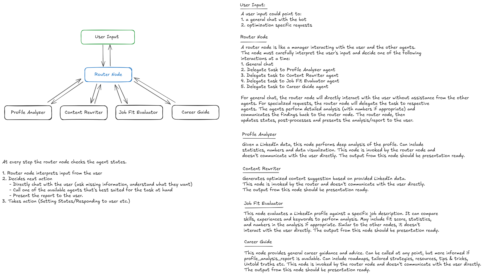

# Initially Planned Schema for Multi-Agent Coordination

## User Input

A user input could point to:

- **General chat** with the bot
- **Optimization specific** requests

---

## Router Node

A router node acts as a manager interacting with the user and other agents. The node must carefully interpret the user's input and decide one of the following interactions at a time:

1. **General chat**
2. **Delegate task** to Profile Analyzer agent
3. **Delegate task** to Content Rewriter agent
4. **Delegate task** to Job Fit Evaluator agent
5. **Delegate task** to Career Guide agent

### Router Node Behavior

- **General chat**: Router node directly interacts with the user without assistance from other agents
- **Specialized requests**: Router node delegates tasks to respective agents
- **Analysis processing**: Agents perform detailed analysis (with numbers if appropriate) and communicate findings back to the router node
- **Final output**: Router node updates states, post-processes, and presents analysis/reports to the user

---

## Agents

### 1. Profile Analyzer

**Purpose**: Deep analysis of LinkedIn data

**Key Features**:
- Statistics and numerical analysis
- Data visualization capabilities
- Presentation-ready output

**Communication**: 
- Invoked by router node only
- No direct user interaction

### 2. Content Rewriter

**Purpose**: Generate optimized content suggestions based on LinkedIn data

**Key Features**:
- Content optimization recommendations
- Presentation-ready suggestions

**Communication**:
- Invoked by router node only
- No direct user interaction

### 3. Job Fit Evaluator

**Purpose**: Evaluate LinkedIn profile against specific job descriptions

**Key Features**:
- Skills and experience comparison
- Keyword analysis
- Fit score calculation
- Statistical analysis with numbers

**Communication**:
- No direct user interaction
- Presentation-ready output

### 4. Career Guide

**Purpose**: Provide comprehensive career guidance and advice

**Key Features**:
- Career roadmaps
- Tailored strategies
- Resources and recommendations
- Tips & tricks
- Industry insights and "untold truths"
- Enhanced guidance when profile analysis is available

**Communication**:
- Invoked by router node only
- No direct user interaction
- Presentation-ready output

---

## Potential Workflow

The router node checks agent states at every step:

### Step 1: Input Interpretation
- Router node interprets user input

### Step 2: Decision Making
Router decides next action:
- **Direct chat** with user (ask missing information, clarify requirements)
- **Call appropriate agent** best suited for the task
- **Present report** to user

### Step 3: Action Execution
- Setting states
- Responding to user
- Processing agent outputs

---

# Actual Implementation

Using LangGraph to build a sophisticated multi-agent orchestration pattern:

### Implementation Details

#### 1. **Router's Dual Functionality**
- **Instruction Extraction Unit**: Analyzes user input using LLM to extract specific instructions, preferences, and context
- **Route Unit**: Makes intelligent routing decisions based on conversation state and prerequisites

#### 2. **State Management**
- **Conversation History**: Maintains chronological conversation flow
- **Dynamic Instructions**: Stores extracted user preferences for specialized agents
- **Processing Flags**: Coordinates agent output processing (`needs_output_processing`, `pending_agent_output`)
- **Completion Tracking**: Tracks which agents have completed their tasks

#### 3. **Specialized Agent Execution**
- Each agent receives:
  - Primary input data (LinkedIn profile, job description, etc.)
  - **User instructions** from the extraction unit
  - **Conversation context** for continuity
- Agents return **markdown-formatted reports** stored in state
- Agents set processing flags to trigger post-processing

#### 4. **Post-Processing Intelligence**
- Router's post-processing node receives:
  - Raw agent output
  - Stored user instructions
  - Conversation context
- Generates **conversational chat responses** that:
  - Summarize key insights
  - Acknowledge user instructions
  - Guide toward next workflow steps
  - Maintain orchestrator personality

#### 5. **Dual UI Rendering**
- **Main Chat**: Displays post-processor's conversational responses
- **Sidebar**: Shows detailed agent reports in expandable sections
  - Profile Analysis with statistics and metrics
  - Content Rewrite suggestions with multiple options
  - Job Fit Evaluation with scoring and gaps
  - Career Guidance with roadmaps and strategies

#### 6. **Workflow Orchestration**
The system enforces optimal workflow sequencing:
1. **Profile Analysis** (requires LinkedIn URL)
2. **Content Rewriting** (requires completed analysis)
3. **Job Fit Evaluation** (requires analysis + job description)
4. **Career Guidance** (enhanced when other steps completed)

#### 7. **Error Handling & Validation**
- **Prerequisite Validation**: Checks data availability before agent deployment
- **Graceful Degradation**: Each node contains comprehensive error handling
- **State Recovery**: Failed operations clear processing flags appropriately

This implementation enables intelligent conversation flow while maintaining separation between conversational responses and detailed analytical outputs, providing users with both natural interaction and comprehensive insights.

